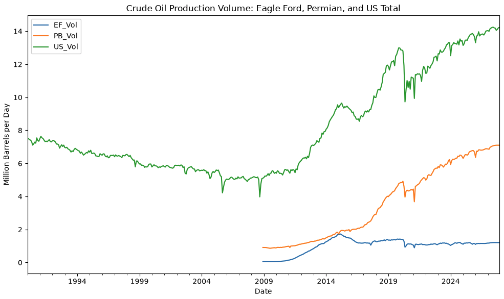

# EIA STEO Analysis

Pulling and analyzing the U.S. Energy Information Administration's Short-Term Energy Outlook via the EIA API. This project focuses on crude oil production and supply projections from the Permian and Eagle Ford basins, the two major Texas shale plays.

## Setup

```bash
python3 -m venv .venv
source .venv/bin/activate
pip install requests pandas python-dotenv matplotlib
```

Create a `.env` file:
```
EIA_TOKEN=your_key_here
```

## Usage
```bash
python steo_analysis.py
```

## Project Structure

- `steo_analysis.py` — exploratory script with documentation
- `eia_steo_pipeline.py` — refactored and reusable pipeline, organized into discrete functions (extract, clean, reshape, compute metrics, compute correlation, generate graph, and export results)

## Findings



*Note: a "play" refers to a geographic region with a known, economically producible concentration of oil or gas. Eagle Ford and the Permian Basin are the two largest oil-producing shale plays in Texas.*

### Production Trend

Eagle Ford drove the early shale boom, with significant percentage swings of up to 217% in 2011, while the Permian Basin became the dominant producer from 2014 onwards. Based on `texas_production_and_share.csv`, we can see that the Permian Basin is projected to account for roughly 50% of total US crude production by 2027.

### Outliers

A region's growth rate volatility naturally declines as its production base matures. Based on `texas_production_and_share.csv` and the z-scores computed, Eagle Ford's year-over-year volatility (`EF_Z`) was concentrated in 2010 to 2012, peaking in 2011, during its early boom. The Permian's (`PB_Z`) volatility came later, from 2017 to 2019, peaking in 2018, as it entered its own growth period.

Using both a threshold method (year-over-year change exceeding 1.5x the regional mean) and z-score analysis (|z| > 2), the two years stand out as statistical outliers.

- **2011 — Eagle Ford** (z = 3.27, growth rate 217.37%)
- **2018 — Permian Basin** (z = 2.84, growth rate 39.74%)

2014 also stands out at the national level (z = 2.58) as the year of the largest volume increase in the U.S. due to rapid expansion of the domestic shale boom.

### Outliers Cause

**2011 — Eagle Ford:** Horizontal drilling paths were completed and hydraulic fracturing expanded rapidly across South Texas. Over 2,800 drilling permits were issued that year, with rig and well completions accelerating production.

**2018 — Permian Basin:** Operators shifted to "super-lateral" wells (stretching 2-3 miles, versus roughly 1 mile in 2011) and mastered pad drilling — using a single surface rig to drill multiple horizontal wells across the Permian's multiple subterranean layers simultaneously. Production grew so fast it outpaced regional pipeline capacity, causing a real infrastructure crisis: local prices collapsed $15-18/barrel below the US benchmark, and operators had to flare significant volumes of natural gas just to keep oil flowing.

### Price Correlation

| Lag | EF_Corr | PB_Corr | US_Corr |
|-----|---------|---------|---------|
| Crude_Price (0-month) | -0.277 | -0.096 | 0.299 |
| Lag 1 month | -0.234 | -0.085 | 0.309 |
| Lag 3 months | -0.193 | -0.089 | 0.323 |
| Lag 6 months | -0.184 | -0.123 | 0.346 |
| Lag 12 months | -0.145 | -0.179 | 0.381 |

At the national level, production shows a weak positive correlation with crude price as lag increases (r = 0.30 at zero lag, r = 0.381 at 12-month lag). It is mildly consistent with the theory that production responds to price with a delay due to drilling taking months to complete. 

Individual plays did not follow this pattern cleanly. Permian Basin's correlation is weak and inconsistent, perhaps suggesting its growth was more so driven by technology (super-lateral wells, pad drilling, etc) than by price response. Eagle Ford shows a persistent negative correlation that weakens steadily with longer lags, perhaps suggesting the basin's structural decline in later years. 

Overall, price alone is a weak indicator of production at any lag tested. This suggests technology, capacity, and basin maturity plays a more significant role in shaping production trends.

## Output

Cleaned data exports available in [`output/`](output/):
- `texas_production_and_share.csv` — yearly production, growth rates, and % share of US total
- `texas_production_price_correlation.csv` — production merged with lagged crude price data

## Data Sources
[EIA Short-Term Energy Outlook](https://www.eia.gov/outlooks/steo/) —
monthly-updated 18-month-ahead forecasts covering production,
consumption, imports, and inventories across US energy categories.